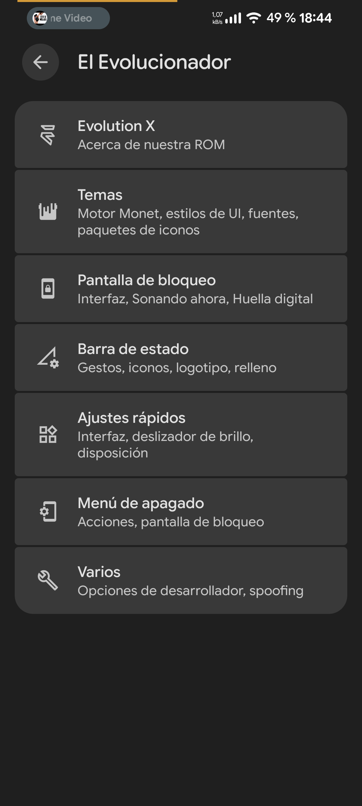
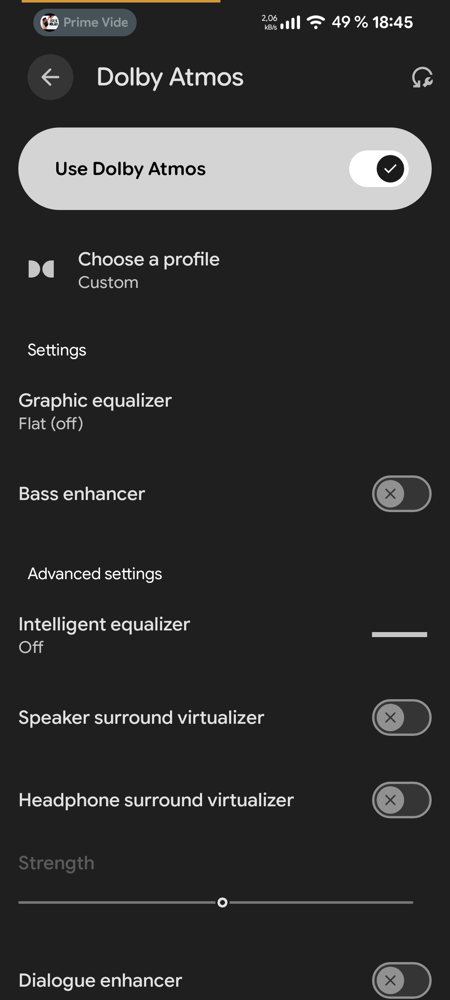

# Evolution X 17 para Xiaomi 12 (cupid) — compilación no oficial

Compilación no oficial de Evolution X 17 (Android 17) para el Xiaomi 12
(`cupid`, SM8450), con varios arreglos propios del dispositivo que no están en la
versión oficial. Todo lo que se cuenta aquí está medido en un móvil real, y se
dice sin adornos qué funciona, qué no y por qué.

**Esto no es una versión oficial de Evolution X.** No reportes al equipo de
Evolution X los fallos que veas en esta compilación.

## Capturas

| Evolution X | Personalización | Dolby Atmos |
|---|---|---|
|  |  |  |

## Qué cambia respecto a una compilación normal

| Cambio | Por qué |
|---|---|
| Log del HAL de cámara apagado | Venía al máximo **y volcando a disco**. Con la cámara abierta se pasa de cientos de líneas por segundo a 6 líneas en 8 segundos. Costaba CPU y escrituras durante toda la grabación. |
| Calibración de audio correcta (`Forte_elus`) | El HAL de audio abre siempre `acdbdata/Forte/Forte_acdb_cal.acdb`. Esta unidad necesita el juego `elus`; cargando el genérico, el DSP se queda sin datos (`No calibration found`) y **sin cancelación de eco**: el interlocutor se oye a sí mismo. |
| 15 pasos de volumen para notificaciones y timbre | Venían con 7 (multimedia tiene 15), así que el nivel más bajo ya sonaba fuerte. |
| Curva de volumen más baja en notificaciones y timbre | Su curva empezaba en −29,7 dB mientras la de multimedia empieza en −58 dB. Ahora el primer paso queda sobre −45 dB en vez de −26 dB. El volumen máximo no cambia. |
| Fix del volumen del dispositivo DEFAULT (`AudioService.getIndex`) | El índice del dispositivo de salida DEFAULT estaba congelado (no lo tocan los ajustes) y hacía que las notificaciones sonaran a veces altas y la multimedia con pantalla apagada fuera inconsistente. Ahora el fallback usa el nivel del altavoz. Ver `docs/NOTAS.es.md` y `patches/parche_volumen_getindex.py`. |
| Guía de cámaras por lente | Qué app usar para cada lente (gran angular real en Google Camera con MGC+qcom, macro con Supermacro, auto-switch del HAL). Ver `docs/CAMARAS.es.md`. |
| `ro.debuggable=0` | La ROM se presenta como compilación de usuario con release-keys; llevar `ro.debuggable=1` encima lo detectan Play Integrity y las apps de banca, y cuesta rendimiento. |
| Root con KernelSU | El root lo da KernelSU-Next (v3.0.1 + SuSFS), compilado en el kernel. Su `su` vive en `/system/bin/su` y es visible para las apps — ocúltalo por app con la denylist de KernelSU; ver "Límites conocidos". |
| App de cámara de 50 MP (`Cam50Test`) | Es la única forma de obtener fotos reales a resolución completa en este móvil (se explica abajo). |

## Sobre el modo de 50 MP — léelo antes de preguntar

El sensor es de 50 MP (8192x6144), pero **el HAL no anuncia ningún tamaño de foto
por encima de 4208x3120**. La resolución completa solo aparece en formatos RAW y
en la etiqueta privada de Xiaomi `qcfa_dimension`. Por eso GCam ofrece "50 MP",
pide algo que nunca se anunció, y se cierra.

El HAL *sí* acepta ese tamaño si se le pide directamente, que es lo que hace la
app incluida. Resultados medidos, misma escena y móvil inmóvil:

| Versión | detalle real | notas |
|---|---|---|
| 12,6 MP ampliado (referencia) | 0,0246 | color correcto |
| vía estándar de Android (`SENSOR_PIXEL_MODE_MAXIMUM_RESOLUTION`) | 0,0197 | **por debajo de la referencia**: el HAL devuelve un reescalado |
| vía Xiaomi (`xiaomi.remosaic.enabled`) | 0,0475 | la única con detalle real de más |

La vía de Xiaomi es también la que tiene tinte rosado y artefactos de color en
patrones finos, y no se puede corregir desde la app: el HAL ignora las ganancias
de color en esa ruta y el desvío depende del tono. La causa de fondo es que el
EEPROM de este módulo declara su región `CrossTalk` con **tamaño 0**: el
remosaico corre sin sus datos de calibración.

Hay un interruptor experimental que anuncia el tamaño completo a todas las apps:

    setprop persist.sys.camera.qcfa_jpeg 1     # y reiniciar cameraserver

Viene **apagado a propósito**. Con él encendido, CameraX elige 8192x6144 y
reserva cuatro imágenes de ese tamaño (unos 400 MB); entonces el HAL de cámara
se muere y la cámara del sistema se cierra al disparar. Las apps que piden una
sola imagen a resolución completa sí funcionan.

## Estado honesto

Funciona: arranque con SELinux **enforcing**, telefonía con VoLTE, Wi-Fi,
Bluetooth, huella, NFC, cámara, vídeo, audio con cancelación de eco correcta y
root con KernelSU.

Límites conocidos: los 50 MP solo por la app incluida y con las pegas de color de
arriba; GCam no puede hacer 50 MP en este móvil; la compilación va firmada con
las claves públicas de AOSP; y el root es visible para las apps — el `su` de
KernelSU-Next está en `/system/bin/su` (es el punto de entrada del root, así que
no se puede borrar sin más). Ocúltalo de las apps que lo detectan (banca,
integridad) con la **denylist / Perfiles de app** de KernelSU-Next, apoyada en el
**SuSFS** que ya trae el kernel. Ver `docs/RECOMENDACIONES.md` → "Ocultar root".

## Dos variantes: con o sin KernelSU

La ROM es la misma; solo cambia la **imagen de arranque (boot)**:

  - **`boot-ksu.img`** — kernel con **KernelSU** integrado (root). *Por defecto.*
  - **`boot-noksu.img`** — kernel limpio, **sin root**.

El root va compilado dentro del kernel (KernelSU-Next + SuSFS). **No** se incluye
el KernelSU más nuevo (v3.3.0): quitó el hook por kprobes y el SuSFS que usa este
kernel, y adoptarlo obligaría a reescribir los hooks del kernel — mucho riesgo de
bootloop para nada. Esta compilación se queda en el **v3.0.1 + SuSFS v2.0.0**
probado.

## Qué incluye una entrega

Las imágenes grandes van adjuntas a la **Release** de GitHub (GitHub no admite
ficheros de más de 100 MB en el repo, ni de más de 2 GB por adjunto):

    rom.zip.part-*      la ROM (OTA de Evolution X), partida; se une con unir_rom.sh
    boot-ksu.img        boot CON KernelSU (root)
    boot-noksu.img      boot SIN KernelSU (limpio)
    dtbo.img  vbmeta.img  vbmeta_system.img  vendor_boot.img  recovery.img

En el repo:

    scripts/     flashear_todo.sh (todo-en-uno), unir_rom.sh, instalar_modulo.sh, ...
    modules/     cupid_ajustes  (módulo de KernelSU, sobrevive a las OTAs)
    patches/     los parches del framework AOSP (soporte cámara 50 MP, etc.)
    docs/        instalación (ES/EN), estudio de los 50 MP, recomendaciones, cambios

Instalación rápida: une la ROM y luego `scripts/flashear_todo.sh --ksu --wipe`.
Los pasos manuales están en `docs/INSTALACION.md`; los consejos de cámara/GCam/
animaciones en `docs/RECOMENDACIONES.md`; y todo el estudio de los 50 MP en
`docs/50MP.md`. Sobre las apps de Deutsche Bank (el boot sin root arregla la app
principal; el 2FA lo bloquea la atestación por hardware): `docs/BANCO.es.md`.

## Créditos

Mira [`CREDITOS.md`](CREDITOS.md). En corto: gracias al **equipo de Evolution X**,
a **quienes han mantenido el Xiaomi 12 (cupid)**, a
**[KernelSU-Next](https://github.com/KernelSU-Next/KernelSU-Next)** y
**[SuSFS](https://gitlab.com/simonpunk/susfs4ksu)**, a **LineageOS** y a la
comunidad que documenta y comparte.

 

## 💖 Apoya este proyecto
Mantener y compilar **Evolution X 17** para el Xiaomi 12 requiere una cantidad altísima de memoria RAM. Actualmente, la compilación me toma unas **4 horas**. Con tu apoyo, podría costear una ampliación de RAM o un servidor más potente para reducir ese tiempo a **menos de 1 hora**, agilizando muchísimo las futuras actualizaciones para todos. ¡Considera apoyarlo!

  

 
